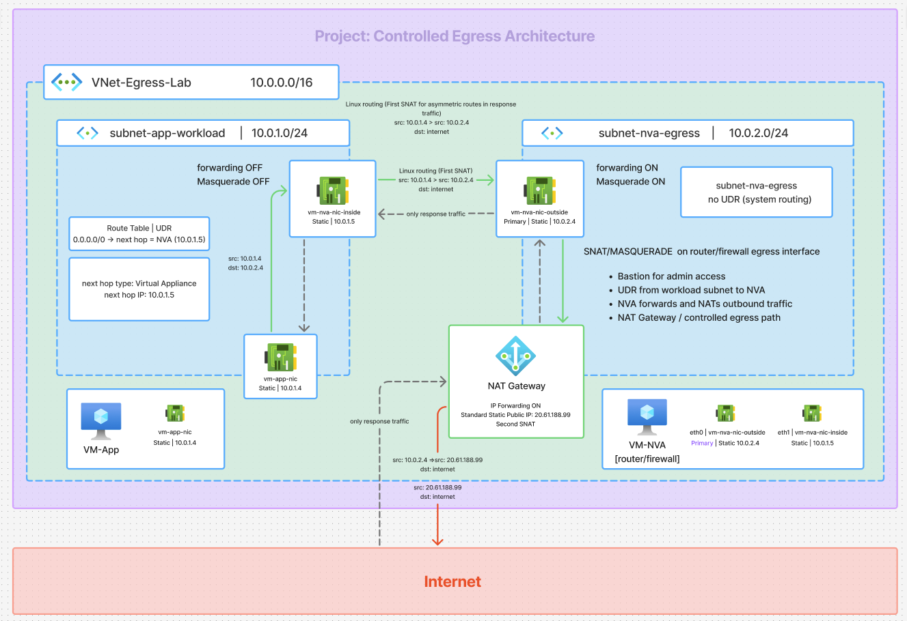
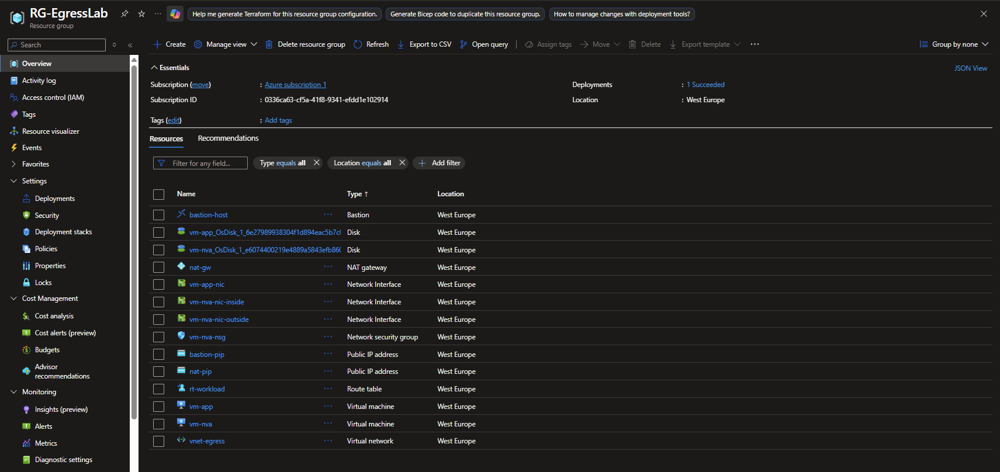

Controlled Egress Architecture (Azure)

## Architecture Diagram

## Overview

This project demonstrates how to design a secure outbound-only (egress) architecture in Azure.

The main idea:

Workloads have no direct internet access
All outbound traffic is controlled and routed through a central point (NVA)
A NAT Gateway provides a single, static public IP

This pattern is commonly used in secure enterprise environments.

## Architecture

Application Subnet
- VM-App (no Public IP)
Egress Subnet
- VM-NVA (Linux, IP forwarding enabled)
Core Components
- User Defined Route (UDR) → forces traffic to NVA
- NAT Gateway → provides outbound public IP

## Resources

## Traffic Flow

Outbound
- VM-App initiates connection
- UDR (0.0.0.0/0) routes traffic → NVA
- NVA forwards traffic (IP forwarding + SNAT)
- NAT Gateway translates private IP → public IP
- Traffic exits to Internet

Inbound (response only)
- Internet responds to NAT Gateway public IP
- NAT Gateway returns traffic to NVA → VM-App
- No unsolicited inbound access is possible

## Key Concepts

- No Public IP on workloads
- Centralized egress control (NVA)
- Single outbound identity (NAT Gateway)
- Segmentation via subnets and routing

## Security Benefits

- Eliminates direct exposure of application VM
- Blocks all inbound connections from the Internet
- Enables inspection and filtering at a central point
- Provides predictable outbound IP (whitelisting ready)

## Validation

To verify outbound path:
- curl ifconfig.me

## Azure Bastion deployed and operational

## Notes

This project was built to understand:
- Real packet flow in Azure
- Interaction between UDR, NVA, and NAT Gateway
- How controlled egress architectures work in practice